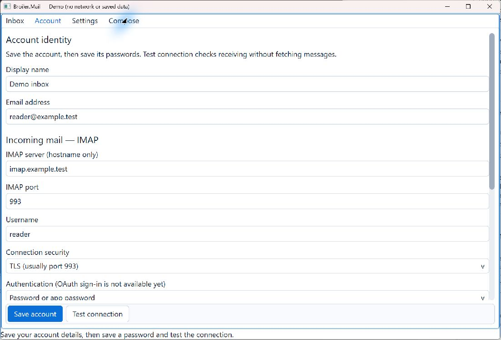
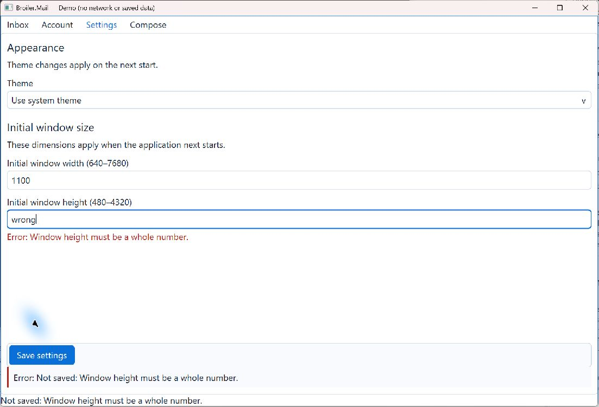
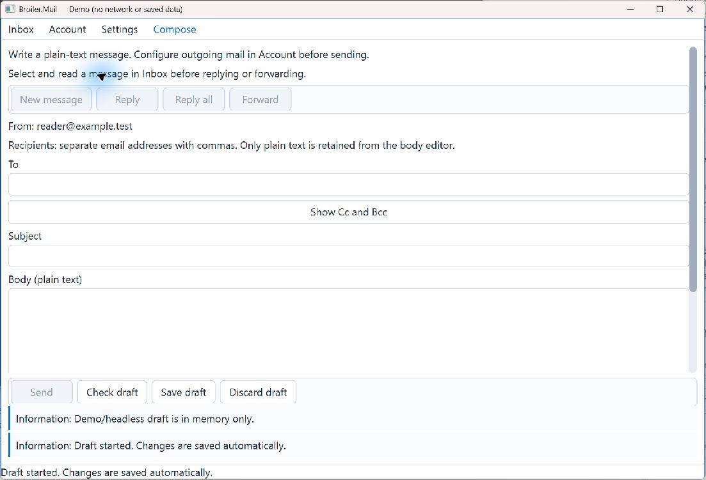
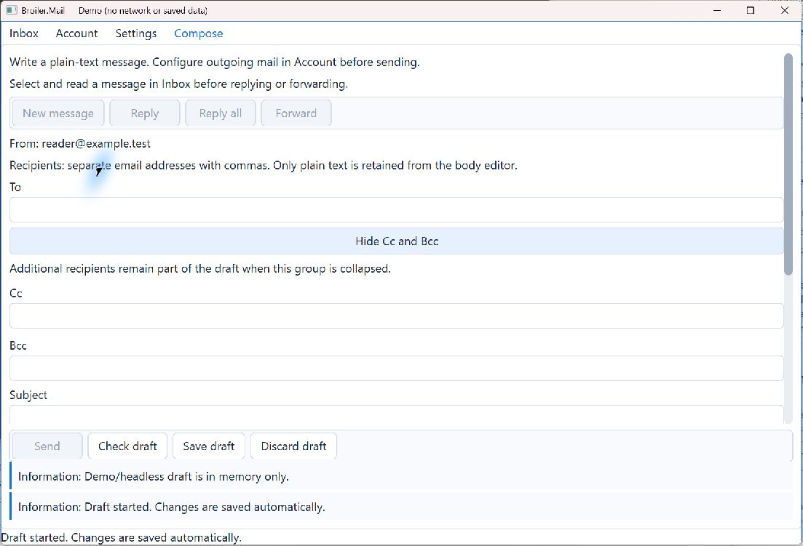

# C-04 — compact forms and feedback

Implemented on 1 October 2026 in Broiler.Mail and the sibling Broiler.UI checkout.
Shared controls and Mail integration are ready for review; public package publication,
native accessibility, and full RTL/system text-scale acceptance remain release work.

## Shared package

`Broiler.UI.Forms.Standard` lives in
`Broiler.UI/src/Implementations/Standard/Layout/Broiler.UI.Forms.Standard`.
It has no Mail, credential, network, or persistence dependency.

| Component | Contract |
| --- | --- |
| `FormField` | Associates a literal wrapping label with a control, optional description, inline error, and invalid group semantics. Editing a `StandardEdit` clears its displayed error; validation still belongs to the application. |
| `FormSection` | Named group, optional Show/Hide button, persistent summary, expanded semantic state, and focus return to the button when collapsing a focused descendant. Values remain in the content tree. |
| `InlineFeedback` | Information, progress, success, warning, or error text, theme colors, stable status semantics, and change announcements through the session. No animation timer. |
| `FormSurface` | Scrollable fields, wrapping persistent actions, bounded independently scrollable feedback, and reveal/focus of an invalid field including expanding its enclosing sections. Empty feedback releases its space. |
| `FormViewport` | Width-constrained standard scrolling used by the surface. |

Existing standard buttons and the wrapping toolbar supply action styling and keyboard
activation. The package does not introduce a second button or icon implementation.

## Mail behavior

- Account fields are grouped into identity, incoming mail, outgoing mail, Sent-copy
  options, and credentials. Save, connection test, and its active cancellation action
  stay outside the scrolling fields. Credential actions remain beside their fields.
- Settings groups appearance and initial window size. Numeric and account validation
  now carries field identifiers instead of requiring the UI to parse human messages.
  Failed validation reveals/focuses the affected field and retains an error banner.
  Retrying clears the old field error; saving settings preserves the splitter ratio.
- Compose keeps Send, Check draft, Save draft, and Discard visible. Cc/Bcc start collapsed
  for an empty draft and expand for recovered/populated drafts. A summary remains when
  populated recipient fields are collapsed. Submission, Sent-copy, storage, and general
  status retain separate states in the bounded feedback area.
- SMTP outcome handling, credential storage, draft durability, and recipient parsing
  remain Mail responsibilities. This work adds no automatic send, resend, or copy retry.

## Reproduce the package build

Mail now pins UI **0.1.0-preview.10.c04.3**, a local development version. It is not a
published NuGet.org release. `NuGet.config` includes `artifacts/c04/packages`.

```powershell
./scripts/Build-C04Preview.ps1 -UiRoot ../Broiler.UI
dotnet build Broiler.Mail.slnx -c Release --no-restore
dotnet test Broiler.Mail.slnx -c Release --no-restore
dotnet run --project src/Broiler.Mail.Windows -c Release --no-build -- --demo
```

The helper discovers Mail's UI package references, follows their project references,
and packs the entire required UI dependency graph with one version. Mail continues to
consume packages, without sibling project references or overwriting existing cached
package DLLs. Preserve both repositories' changes when transferring this work. The
generated feed is ignored by Git and must be rebuilt on a fresh machine.

This consistency matters: the original local preview.10 cache mixed a newer core
semantic-node constructor with older control assemblies. New semantic tests exposed a
`MissingMethodException`; rebuilding the complete graph eliminated it. This observation
does not establish a defect in the published preview.10 packages.

After further UI source edits, use a new preview version in `Directory.Packages.props`
before packing, because NuGet caches versions as immutable. For release, publish the
reviewed UI graph under the agreed official version, update Mail's pin, remove the
local feed/bootstrap requirement, and restore/test from a clean package cache.

## Verification and evidence

- Shared UI suite: 256 tests pass, including six new C-04 cases covering long feedback,
  narrow layouts, light/dark/high-contrast tokens, doubled label/button font sizes,
  mixed Arabic/Latin labels, literal ampersands, disclosure keyboard activation and
  value retention, focus return, status event deduplication, and finite measurement.
- Mail suite: 212 tests pass across portable, Windows, and Linux test projects.
  Added checks cover invalid field focus/retry, expanding invalid advanced fields,
  persistent cancellation, and splitter preservation. Existing composer navigation,
  credential, persistence, submission, and Sent-copy checks continue to pass.
- Windows demo inspected through the computer-use skill: Account, invalid Settings,
  empty/new Compose, and expanded recipient fields. Synthetic demo data only.
  Images below are the `.c04.1` inspection build; `.c04.3` adds literal-label support,
  status events, and finite unconstrained measurement. Mail subsequently moved submission
  and Sent-copy banners into the persistent feedback region. The pictured states are
  visually unchanged. Capture final release baselines after the package is published.
- Native tree capture still exposes only the host pane. Group/status semantics and
  events are tested at toolkit level; Narrator/UIA acceptance depends on H-01.
- Doubled fonts and mixed-script samples are layout tests, not proof of Windows 200%
  text-setting integration or full RTL shaping/mirroring. Those remain explicit release
  checks. No Linux desktop visual session was run.

Screenshot environment: Windows native demo, light theme, default application fonts,
1100×720 logical client area (1103×751 captured window), Graphics preview.7, UI local
preview.10.c04.1. OS text-scale/display-scale settings were not altered or independently
measured. These are manual review fixtures, not a pixel-diff regression harness.









See [native tree capture](native-tree.txt).
