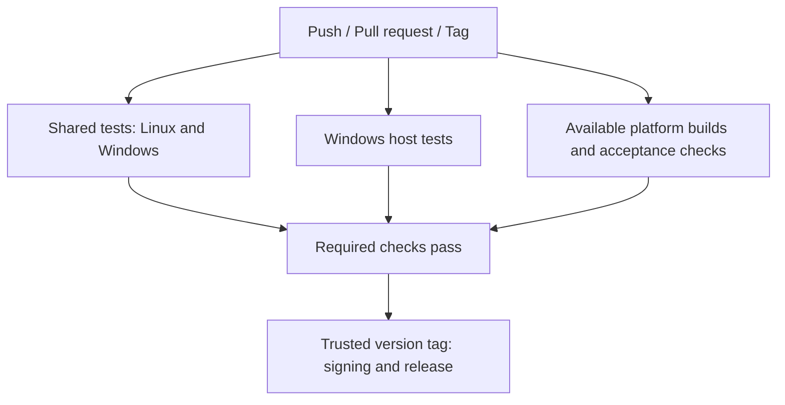
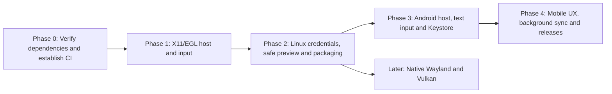

# Cross-Platform Roadmap: Linux, Android, and CI/CD

Status: Proposal / Planning. Reviewed: 2026-09-30.  
Target platforms: Windows (x64, arm64), Linux (x64, arm64), Android (arm64, x64). These are planned targets, not a claim of validated support.

## 1. Portability Assessment and Existing Contracts

Static inspection supports reusing the domain, infrastructure, and application layers. A portable target framework does not establish runtime compatibility; platform support must be demonstrated by the test and acceptance matrix below.

| Project | Target framework | Dependencies | Current assessment |
| :--- | :--- | :--- | :--- |
| `Broiler.Mail.Core` | `net10.0` | None | Domain models, validation, and contracts including `ICredentialStore`, `IMailSender`, `ISentCopyWriter`, and `IDraftStore` have no identified OS dependency. |
| `Broiler.Mail.Infrastructure` | `net10.0` | MailKit, framework JSON/file APIs | IMAP/SMTP, persistence, and `HtmlPreviewPolicy` are candidates for reuse. Verify filesystem behavior, TLS, and cancellation on each target. |
| `Broiler.Mail.Application` | `net10.0` | `Broiler.UI.*.Standard`, Core | Shared views, view models, navigation, and draft handling can be reused through host adapters. Replace Windows-specific credential and theme wording and adapt mobile layout/input. |
| `Broiler.Mail.Tests` | `net10.0` | xUnit, Microsoft.NET.Test.Sdk | Intended to run on desktop .NET targets. Cross-platform pass counts are unverified; record actual results per OS, architecture, SDK, and revision. Android also requires device/emulator validation. |
| `Broiler.Mail.Windows` | `net10.0-windows` | Broiler.Graphics.Windows, Broiler.Native.Windows, Broiler.HTML.Image | Windows event loop, Credential Manager, clipboard, and Direct2D host. The current HTML preview runs on another thread in the mail process; it is not a process sandbox. |
| `Broiler.Mail.Windows.Tests` | `net10.0-windows` | xUnit, Windows host | Existing credential, HTML-preview, and native draft-close tests must remain part of Windows CI. |

Reuse `IUiHost`, `IUiClipboardHost`, and `IUiTextInputHost` from Broiler.UI, `ICredentialStore` from Core, and `IHtmlPreviewHost` from Application. Do not introduce parallel `Broiler.Mail.Hosting` interfaces for responsibilities already covered by those contracts. Extract only demonstrated shared implementation; keep reusable platform mechanics in the appropriate Broiler component where practical.

Dependency availability must be checked at the package versions selected in `Directory.Packages.props`. A sibling repository implementation does not prove that the same feature exists in the consumed package.

## 2. Linux

### 2.1 Host, Windowing, and Input (`Broiler.Mail.Linux`)

- **Initial backend:** `Broiler.Graphics.Linux.OpenGL` with X11/EGL. Confirm its released package and native requirements in Phase 0.
- **Upstream prerequisites:** Native Wayland presentation and Vulkan WSI/swapchain presentation are unfinished in the inspected Broiler.Graphics sources. Track them as separate upstream milestones, outside the first Linux host. Report tested XWayland operation separately from native Wayland support.
- **Host:** Implement `LinuxMailWindow` and `LinuxUiHost` using the existing UI host contracts, including scheduling, focus, resize, disposal, and draft flush on close.
- **Desktop input:** Add X11 pointer, wheel, keyboard, shortcuts, and layout-aware text/IME composition. The existing graphics surface event loop is insufficient, and the raw evdev demo is not the desktop input strategy: normal users must not need `/dev/input` permissions. Reuse or extend Broiler.Input/Broiler.UI at their host boundaries.
- **Text editing:** Route composition, commit, selection, deletion, and caret state into Broiler editors. Verify non-US layouts, Unicode, dead keys, and IME input in account fields and the composer.
- **Scaling:** Handle X11 DPI and resize initially. Add compositor scaling, fractional scaling, and input-coordinate conversion with the later native Wayland backend.

### 2.2 Secure Credential Storage

- Implement `LinuxSecretServiceCredentialStore : ICredentialStore` using D-Bus Secret Service (`org.freedesktop.secrets`, optionally through libsecret). Test GNOME Keyring and compatible KWallet services, including locked collections, unlock cancellation, and unavailable services.
- Preserve account, protocol, and server identity binding from the existing `CredentialKey` contract.
- If Secret Service is unavailable or unlocking is canceled, offer session-only credentials and explain that they will not be persisted. Never silently write passwords to disk or derive an encryption key from machine-id, username, or another host identifier.
- An optional passphrase store is a separate feature: use a reviewed password-based KDF with a random salt and versioned parameters, authenticated encryption with fresh nonces, explicit unlock/lock behavior, and recovery/error handling. Do not ship this fallback until those requirements are implemented and tested.

### 2.3 Clipboard and System Services

- Implement `IUiClipboardHost` in the Linux host using X11 `CLIPBOARD`; define `PRIMARY` behavior explicitly. Add Wayland clipboard handling with its compositor/input integration milestone.
- Open approved external links through desktop services; use portals where required by packaging. Preserve the application's URL policy and user-initiated navigation boundary.
- Read appearance preferences through the desktop Settings portal where available, with an explicit fallback. Shared UI wording must describe the system theme rather than Windows.

### 2.4 Filesystem and Storage Paths

- Account and draft data: `$XDG_DATA_HOME/broiler-mail`, defaulting to `~/.local/share/broiler-mail`.
- Settings: `$XDG_CONFIG_HOME/broiler-mail`, defaulting to `~/.config/broiler-mail`.
- Validate XDG overrides and verify owner-only permissions, atomic replacement, concurrent access, cancellation, and recovery on supported filesystems. Keep credentials outside ordinary account/settings files.

### 2.5 HTML Preview

- Implement `LinuxHtmlPreviewHost : IHtmlPreviewHost` subject to the existing HTML security gate in [the main roadmap](roadmap.md).
- A preview window or dedicated thread is not security isolation. Before rendering mail HTML with Broiler.HTML, establish a restricted renderer process with no account credentials, arbitrary file access, or direct network access. Define bounded IPC, content/image limits, timeouts, termination, and crash recovery. If that boundary cannot be demonstrated, use a maintained sandboxed renderer through the same adapter.
- Retain sanitization and deny-by-default resource handling as additional controls. Explicitly approved remote-image fetching belongs outside the renderer and must obey the application's resource policy.
- Extract reusable portions of `ScrollableHtmlView`, `HtmlViewElement`, and `DenyingRequestTransport` from [HtmlPreviewWindow.cs](../src/Broiler.Mail.Windows/Preview/HtmlPreviewWindow.cs) where appropriate. They are currently internal to the Windows assembly; reuse requires extraction and adaptation to the process boundary, not a reference to the Windows host.
- Acceptance must demonstrate denied file/network access, no credential access, bounded malformed-content handling, and a usable mail application after renderer failure. A Flatpak sandbox around the whole application does not satisfy renderer isolation.

### 2.6 Packaging and Distribution

- Start with self-contained `.tar.gz` releases for validated `linux-x64` and `linux-arm64` targets.
- Inventory native runtime dependencies, including X11, EGL/OpenGL loaders, the selected driver/software-rendering stack, and Secret Service integration. Self-contained .NET publishing does not supply these system dependencies.
- Build and smoke-test each architecture on a compatible runner. Document the minimum distribution/glibc baseline and supported display/driver combinations.
- Add AppImage after the tarball works on clean target systems; validate bundled libraries, architecture, and remaining host driver requirements.
- Add Flatpak separately with portal integration, narrowly scoped D-Bus access, and network access for mail transport. Verify input, clipboard, credentials, storage, and renderer isolation in the packaged application.

## 3. Android

### 3.1 Host and Runtime (`Broiler.Mail.Android`)

- Target `net10.0-android`; define minimum/target Android API levels and supported ABIs during dependency verification.
- Implement `MainActivity : Android.App.Activity` with a `SurfaceView` and `Broiler.Graphics.Android.AndroidOpenGlEsRenderer`, using `Broiler.Native.Android` for native bindings. No `BroilerActivity` base class exists in the inspected components. Verify the renderer's published package before committing to it; Vulkan is not required for the initial host.
- Reuse host, scheduling, surface lifecycle, and input patterns from the existing Broiler Android components. Connect surface recreation, resize, focus, pause/resume, and disposal to shared application state.
- Persist draft edits continuously through the existing draft machinery. Handle activity recreation and process death; do not rely on `OnDestroy` being called to save data. Suspend or cancel foreground network work when appropriate and keep background synchronization separately owned.

### 3.2 Secure Credential Storage

- Implement `AndroidKeystoreCredentialStore : ICredentialStore` with platform Android Keystore APIs and AES-GCM encryption of credentials stored in app-private files. Use non-exportable generated keys, unique nonces, and the existing account/protocol/server binding.
- Do not introduce the deprecated AndroidX `EncryptedSharedPreferences` API for this new implementation. Define backup/device-transfer exclusions for encrypted credentials and handle missing or invalidated keys by clearing unusable secrets and requesting authentication again, without deleting drafts.
- Check the actual key security level. Hardware backing is device-dependent, not guaranteed: define and document the software-backed Keystore fallback, and fail safely if secure key creation is unavailable.
- Test key loss, restore, failed/canceled writes, credential replacement, and deletion without logging secrets. See [Android Keystore guidance](https://developer.android.com/privacy-and-security/keystore) and the [EncryptedSharedPreferences deprecation and backup warning](https://developer.android.com/reference/androidx/security/crypto/EncryptedSharedPreferences).

### 3.3 Touch, Keyboard, and Text Input

- Wire `Broiler.Input.Touch.Android` for tap, swipe, and scrolling.
- Implement the custom view's `InputConnection` and `InputMethodManager` focus/show/hide integration. Reuse `Broiler.Input.Text.Android` and applicable keyboard components for composition, commit, deletion, selection, and physical keyboard input. Existing Broiler Android editor bridges are reference implementations.
- Monitor IME insets so the keyboard does not obscure the active editor; inset padding alone does not provide text input.
- Integrate supported Android back navigation APIs with message detail, dialogs, and keyboard state before exiting. Choose the Activity/AndroidX integration consistently with the selected host.
- Validate Unicode, composition, selection, password fields, keyboard dismissal, and activity recreation with a draft in progress.

### 3.4 Mobile Layout and HTML Preview

- Adapt the desktop `Inbox`, `Account`, `Settings`, and `Compose` navigation into a single-pane flow with a bottom bar or drawer and a back stack.
- Use full-screen message preview and minimum 48-by-48 dp touch targets, with readable text scaling.
- Select an Android `IHtmlPreviewHost` implementation and demonstrate the same HTML security boundary as on desktop. Reusing an in-process Broiler renderer is not sufficient; HTML-enabled Android releases depend on completing this gate.

### 3.5 Storage and Files

- Use the app-private files directory for account/settings/draft data, with explicit backup policy distinct from credential storage.
- Use Android Storage Access Framework for attachments/exports when those features are implemented. Treat granted document URIs as capabilities rather than assuming filesystem paths.

### 3.6 Background Synchronization and Notifications

- Use WorkManager periodic work for best-effort mailbox checks, respecting its scheduling constraints, connectivity requirements, and OS deferral. Do not promise immediate delivery or an always-running IMAP connection.
- Coordinate foreground and background sync to avoid duplicate work and notifications. Workers must handle unavailable credentials, cancellation, retry, and process restart.
- Add a new-mail notification channel, safe pending-intent navigation, and the `POST_NOTIFICATIONS` declaration/runtime permission flow on Android versions that require it. Denied notification permission must leave foreground mail usable.

## 4. CI/CD and Release Validation

Introduce CI before adding hosts. Add platform build jobs as their projects become buildable. The Linux project foundation now builds, but its interactive host and packaging checks remain pending; the Android project is still planned.

### 4.1 Pipeline Structure



- Select the .NET SDK using `global.json`, record the resolved version, and pin workload/toolchain versions for reproducible releases. Verify restoration from package feeds without relying on sibling checkouts or a developer's NuGet cache.
- Pull-request builds and tests must not require release secrets. Restrict signing and publishing to trusted version-tag workflows and the configured release environment.
- Record OS, architecture, SDK/workload versions, package versions, and test results with artifacts. Failed or skipped required acceptance checks block release for the affected target.

### 4.2 Shared and Windows Tests

- Run `dotnet test tests/Broiler.Mail.Tests/Broiler.Mail.Tests.csproj -c Release` on Linux and Windows, starting with x64. Add architecture-matched ARM64 validation before claiming ARM64 support.
- On Windows also run `dotnet test tests/Broiler.Mail.Windows.Tests/Broiler.Mail.Windows.Tests.csproj -c Release`. Provide a runner/session capable of native-window and credential tests; a build-only smoke check does not replace them.
- Add Linux host/credential/input and Android device/emulator acceptance suites with their hosts. Shared desktop unit tests do not establish Android lifecycle or Keystore correctness.

### 4.3 Linux Builds

- Use architecture-matched x64 and ARM64 runners for publish and smoke tests. A cross-published artifact alone does not establish support.
- Provision runtime X11/EGL/OpenGL libraries and a software-rendering stack for CI, plus a display session and isolated Secret Service fixture where required. Keep build headers separate from the runtime dependency manifest; add Wayland/Vulkan dependencies only with those backends.
- Planned publish commands:

  ```bash
  dotnet publish src/Broiler.Mail.Linux/Broiler.Mail.Linux.csproj -c Release -r linux-x64 --self-contained true -o artifacts/linux-x64
  dotnet publish src/Broiler.Mail.Linux/Broiler.Mail.Linux.csproj -c Release -r linux-arm64 --self-contained true -o artifacts/linux-arm64
  ```

- Execute only the matching target on each runner. Package tarballs and SHA256 checksums after checks pass. Add clean-system AppImage/Flatpak installation and launch checks with those packaging milestones.

### 4.4 Android Builds

- Use an Android-capable build runner with a pinned, compatible JDK, Android SDK, and .NET Android workload. Java 17 is supported by the inspected workload; select and validate the release toolchain rather than treating that as a permanent requirement.
- Configure the SDK/workload version before `dotnet workload install android`. Define Android API levels, ABIs, and APK/AAB output properties explicitly in the project or build configuration.
- Planned publish command: `dotnet publish src/Broiler.Mail.Android/Broiler.Mail.Android.csproj -c Release -f net10.0-android`.
- Run x64 emulator acceptance and ARM64 device/emulator validation for supported targets. Verify installation, text entry, rotation/recreation, key loss, draft recovery, and preview security.
- Use a test signing identity for installable CI APKs. Apply the protected production identity only in trusted release jobs; validate the resulting APK/AAB signatures and generate checksums before publishing.

### 4.5 Windows Builds

| Runtime | Required runner architecture | Publish command |
| :--- | :--- | :--- |
| `win-x64` | x64 Windows (`windows-latest`) | `./scripts/Publish-Windows.ps1 -Runtime win-x64` |
| `win-arm64` | ARM64 Windows (for example an available `windows-11-arm` runner or a self-hosted equivalent) | `./scripts/Publish-Windows.ps1 -Runtime win-arm64` |

The [existing script](../scripts/Publish-Windows.ps1) executes the published EXE before archiving it. Do not invoke its ARM64 path on an x64 runner. If cross-publishing is introduced, separate packaging from smoke execution and require an architecture-matched test job before release. Check runner availability for the repository against [GitHub's runner documentation](https://docs.github.com/en/actions/reference/runners/github-hosted-runners).

The script currently creates an unsigned ZIP and a SHA256 checksum. Signing is separate release work: define Authenticode signing for executable payloads, verify signatures, then repackage and regenerate checksums. Never label checksum-only artifacts as signed.

### 4.6 Releases

- Trigger publishing on trusted `v*` tags after the required tests, host checks, packaging checks, and HTML security gates for the released targets pass.
- Download artifacts from the validated jobs for that same revision. Publish only platforms that have completed their acceptance gates; do not require nonexistent Linux/Android jobs during the initial Windows-only CI phase.
- Apply configured signing, verify final artifacts, generate final checksums and release notes, and publish to GitHub Releases with the tested platform/architecture matrix and known limitations.

## 5. Phased Implementation



### Phase 0: Dependency Verification, Contract Reuse, and CI

Implementation and evidence: [Phase 0 foundation](phase-0-foundation.md). The hosted matrix has not yet run; the cross-platform exit gate remains open.

- [x] Verify and pin published Broiler packages needed for X11/EGL and Android, documenting features still available only in upstream sources.
- [x] Reuse existing UI/Core/Application contracts; identify only the shared implementation that needs extraction.
- [x] Replace Windows-specific copy in shared views and view models.
- [x] Add shared Linux/Windows and Windows host CI jobs with recorded SDK/dependency/TRX evidence and failure on missing/skipped suites.
- [ ] Confirm a passing hosted Linux/Windows/ARM64 matrix for the implementation revision.
- [x] Add Windows publishing with architecture-matched smoke tests and truthful unsigned artifact metadata.
- [x] Specify the renderer process boundary, threat model, IPC/resource limits, and security acceptance checks before porting the current preview.

Exit gate: clean CI restores and passes on its declared matrix, dependency gaps are explicit, and each new host has agreed contracts and security requirements.

### Phase 1: Minimal X11/EGL Linux Host

- [x] Create `src/Broiler.Mail.Linux/` targeting `net10.0` with the verified OpenGL/X11 backend. See [Linux project foundation](linux-host.md) for build and preflight diagnostics; interactive hosting remains below.
- [x] Add a managed `LinuxUiHost` adapter for `IUiHost`: surface size/DPI, frame submission, and invalidation state, with headless regression tests.
- [ ] Connect `LinuxUiHost` to the native window loop: scheduling, rendering, focus, resize notifications, close/draft flush, and resource ownership.
- [ ] Implement ordinary desktop pointer/keyboard routing, shortcuts, layout-aware text/IME composition, and X11 clipboard.
- [ ] Configure XDG paths and verify storage permissions and recovery.
- [ ] Add Linux build/host checks and a publish script with native dependency documentation.

Exit gate: an unprivileged user can navigate, enter account details and Unicode draft text, copy/paste, resize, and close/reopen with the draft intact. No raw input device access is required. Text preview remains available while HTML isolation is unfinished.

### Phase 2: Linux Credentials, Safe Preview, and Packaging

- [ ] Implement Secret Service credentials, identity binding, unlock/cancellation handling, and explicit session-only fallback.
- [ ] Extract reusable preview implementation and implement the restricted renderer process or a maintained sandboxed renderer through `IHtmlPreviewHost`.
- [ ] Verify resource denial, credential separation, limits, and renderer crash recovery; apply the same security gate to the existing Windows preview before claiming it passes.
- [ ] Validate x64 and ARM64 tarballs on clean target systems, including native graphics dependencies, TLS, and mail acceptance checks.
- [ ] Add and validate AppImage and Flatpak separately after tarball acceptance.

Exit gate: credentials and mail operations work on the declared Linux matrix, hostile preview fixtures cannot escape the renderer boundary, and packaged applications pass clean-system checks.

### Phase 3: Android Host, Text Input, and Keystore

- [ ] Create `src/Broiler.Mail.Android/` and wire `Android.App.Activity`, the OpenGL ES renderer, and surface lifecycle.
- [ ] Implement touch, clipboard, `InputConnection`, text composition, selection, deletion, and keyboard focus/show/hide integration using existing Broiler components.
- [ ] Implement direct Keystore-backed credentials, capability checks, backup exclusions, and key-loss recovery.
- [ ] Implement durable draft state and verify rotation, activity recreation, and process death.
- [ ] Add Android build and device/emulator checks as soon as the host is runnable.

Exit gate: account setup and draft editing work with the soft keyboard, credentials recover safely after key loss, and drafts survive lifecycle transitions on the tested ABIs.

### Phase 4: Mobile UX, Background Sync, and Releases

- [ ] Adapt navigation, touch targets, text scaling, back behavior, and IME inset handling for mobile screens.
- [ ] Implement and validate Android HTML preview under the same security requirements as desktop.
- [ ] Add WorkManager synchronization, foreground/background coordination, notifications, and permission-denied behavior.
- [ ] Configure APK/AAB output, protected release signing, signature verification, checksums, and installation acceptance.
- [ ] Publish only validated targets and record device/API/ABI coverage and remaining limitations.

Exit gate: supported Android devices pass mail, preview, lifecycle, input, notification, and signed-package acceptance checks.

### Later: Native Wayland and Vulkan

- [ ] Complete upstream presentation, ownership/lifecycle, input/text, clipboard, and scaling prerequisites before consuming these backends.
- [ ] Verify driver/device-loss recovery and hardware/software rendering on the intended x64/ARM64 matrix.
- [ ] Add native Wayland/Vulkan packaging and acceptance checks before claiming support; keep the validated X11/EGL path available.
