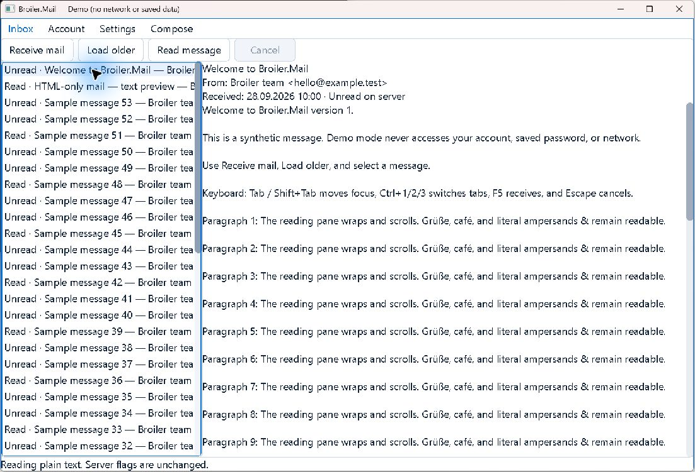
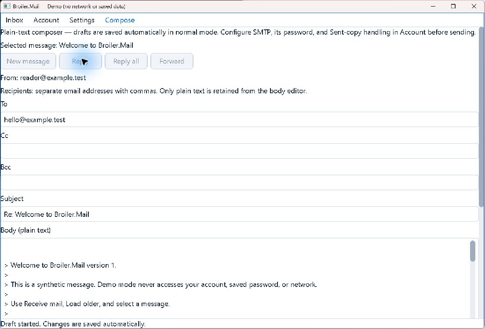
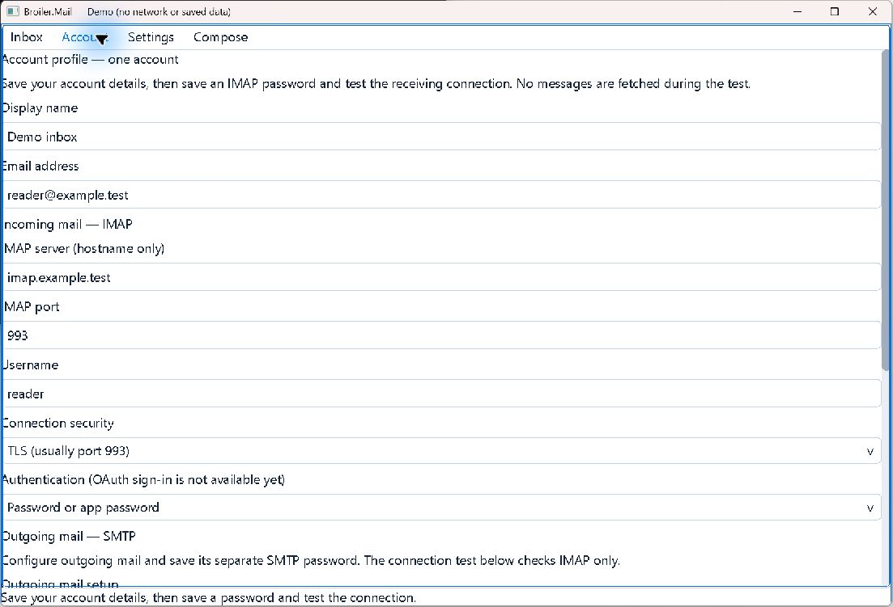

# Native experience review evidence

Date: **30 September 2026**. Main conclusions: [Mail roadmap](../experience-roadmap.md) and [shared component roadmap](../broiler-experience-components-roadmap.md).

## Scope and baseline

- Windows desktop, .NET SDK **10.0.401**, Release configuration, current working tree at HEAD `08e2bc6` plus pre-existing uncommitted changes.
- Built `src/Broiler.Mail.Windows/Broiler.Mail.Windows.csproj` with `--no-restore`.
- Ran the freshly built executable with `--demo`; it uses synthetic `example.test` identities and in-memory stores. No real mailbox was opened, no mail was sent, and no account/password was saved.
- Reviewed main window, loaded list, body loading, plain-text reading, reply creation, nested composer scrolling, Account, Settings, HTML entry, separate HTML window, and plain-text toggle.
- Screenshots are original native-window captures. Blue glows/pointer marks visible in some captures are interaction/capture overlays, not proposed product styling.
- Main captures are 1103×751 including OS chrome, around the default 1100×720 logical client area. Preview captures are 903×731 including chrome. No multi-DPI or multi-monitor qualification was performed.
- A resize gesture and automated F5/Ctrl+3 attempts did not produce the intended visible transition in this session. Treat small-window layout and native keyboard behavior as unresolved validation, not passed tests or confirmed product failures.
- Source review included current Mail views/view models/host/preview and selected sibling component implementations. Sibling source can be ahead of consumed packages.

## Screenshots

| Capture | What it establishes |
| --- | --- |
| [01 — Empty inbox](01-inbox-empty.png) | Empty list/reader, disabled secondary actions, bottom status, minimal spacing |
| [02 — Loaded inbox](02-inbox-loaded.png) | 50 synthetic rows; composite labels clipped by fixed list width |
| [03 — Loading body](03-message-loading.png) | Normal loading combined with premature retry guidance |
| [04 — Plain text](04-message-plain-text.png) | Reader text/header density, tight pane edges, similar typographic hierarchy |
| [05 — Initial composer](05-compose-initial.png) | Explanatory copy and recipient fields dominate above the editor |
| [06 — Reply](06-compose-reply.png) | Correct synthetic To/subject/quote; action buttons remain below viewport |
| [07 — Composer actions](07-compose-actions.png) | Page scrolling needed for Check/Save/Send/Discard; nested body scrolling |
| [08 — Settings](08-settings.png) | Full-width fields/buttons; theme and dimensions apply at next start |
| [09 — Account setup](09-account-setup.png) | Long stacked setup form; primary save/test not visible initially |
| [10 — HTML entry](10-html-entry.png) | HTML preview is a separate explicit action above text fallback |
| [11 — HTML window](11-html-preview.png) | Controlled HTML renders in a separate window; HTML body and app chrome have different text appearance |
| [12 — Plain-text toggle](12-html-plain-toggle.png) | Preview toggles back to plain text |

Representative current-state views:







## Native accessibility observation

[Raw captured tree](accessibility-tree.txt): native window, unnamed pane, title bar, system menu, minimize/maximize/close. No mail rows, edit fields, buttons, tabs, or message content were exposed through the inspection tool.

Source corroboration: `WindowsUiHost` implements `IUiHost`, `IUiClipboardHost`, and `IUiTextInputHost`; it does not implement `IUiAccessibilityHost`. Broiler.UI contains that neutral contract. This is evidence for a missing host bridge; actual Narrator/other screen-reader acceptance was not run.

## Dependency probe

A temporary project under ignored `artifacts/ux-review-probe` referenced the DLLs in the built Windows output. It did not replace package references or alter app code. Probe output:

```text
Graphics: 0.1.0-preview.7+d3fc10a0819461f877ae63b62e92c7f48b8f166f
BRenderOptions.Default: BRenderOptions { Antialias = False, VSync = False, SubpixelText = False }
new BRenderOptions(): BRenderOptions { Antialias = False, VSync = False, SubpixelText = False }
Explicit true options: BRenderOptions { Antialias = True, VSync = True, SubpixelText = True }
BWindowOptions.RenderOptions: BRenderOptions { Antialias = False, VSync = False, SubpixelText = False }
UI: 0.1.0-preview.10+d5eebdbad83b75415e6208a463759e097744538c
Broiler.UI.Standard.StandardThemeController present: True
Broiler.UI.Standard.StandardAnimationScheduler present: True
```

Minimal reproduction in a .NET console project referencing Mail's pinned Graphics package:

```csharp
using Broiler.Graphics.Rendering;
using Broiler.Graphics.Windowing;
Console.WriteLine(BRenderOptions.Default);
Console.WriteLine(new BRenderOptions());
Console.WriteLine(new BRenderOptions(true, true, true));
Console.WriteLine(new BWindowOptions().RenderOptions);
```

Source path: `D:/Broiler.Graphics/src/Broiler.Graphics/Rendering/BRenderOptions.cs`. The zero initialization explains the probe. Rendering code maps false antialiasing to aliased Direct2D text. The review did not implement the proposed correction or measure its visual/performance delta.

## Build and tests actually executed

```powershell
dotnet build src/Broiler.Mail.Windows/Broiler.Mail.Windows.csproj --no-restore -c Release -v minimal
./src/Broiler.Mail.Windows/bin/Release/net10.0-windows/Broiler.Mail.Windows.exe --smoke-test
dotnet test Broiler.Mail.slnx --no-restore -c Release --logger 'trx;LogFilePrefix=ux-review' --results-directory artifacts/ux-review-tests -v minimal
```

| Check | Result |
| --- | --- |
| Windows Release build | Passed, 0 warnings / 0 errors |
| Headless composition + four-tab render smoke | Passed |
| `Broiler.Mail.Tests` | 195 passed; 0 failed; 0 skipped |
| `Broiler.Mail.Windows.Tests` | 6 passed; 0 failed; 0 skipped |
| `Broiler.Mail.Linux.Tests` | 3 passed **on Windows**; 0 failed; 0 skipped |
| Total | **204 passed** |

Local TRX results are under ignored `artifacts/ux-review-tests`. Passing Linux-foundation tests on Windows does not demonstrate a native Linux mail host. SMTP/IMAP fixture success is not live-provider acceptance. The existing HTML tests are not proof of process containment.

## Source evidence map

| Finding | Main location / symbol |
| --- | --- |
| Fixed list and composite row | `src/Broiler.Mail.Application/Views/InboxView.cs`, `CreateContent` / `Update` |
| Retry guidance during loading | Same `Update`, body-null branch |
| Selection/body cleared on successful receive | `ViewModels/InboxViewModel.cs`, `LoadPageAsync` |
| Cancellation/stale-result protection | Same file, `RunAsync` generation guard |
| Reader is non-editable label | `Preview/ScrollableMessageText.cs`, `_label` |
| Composer action placement and whole-text extraction | `Views/ComposerView.cs`, `CreateContent` / `Capture` |
| Existing serialized/coalesced draft writes | `Persistence/DraftJournal.cs`, `Update` / `WriteAsync` |
| Restart-only settings | `Views/SettingsView.cs`, `Windows/Program.cs`, `Windows/Services/WindowsTheme.cs` |
| Same-process HTML thread | `Windows/Preview/WindowsHtmlPreviewHost.cs`, `ShowAsync` |
| Early remote-image success label and post-read byte check | `Windows/Preview/HtmlPreviewWindow.cs`, `LoadRemoteImagesAsync` |
| Full bitmap/PNG/upload and 8192-height cap | Same file, `HtmlViewElement.EnsureRendered` |
| Incomplete native accessibility boundary | `Windows/Hosting/WindowsUiHost.cs` interface list |
| Intentional synthetic latency | `Windows/DemoApplication.cs`, `DemoReceiver` (500/300 ms) |

Paths abbreviated in the table are beneath the relevant `src/Broiler.Mail.Application` or `src/Broiler.Mail.Windows` project. These are source hypotheses where runtime reproduction is not explicitly recorded above.

## What remains unmeasured

Frame timing, input-to-presentation latency, cold startup, sustained idle CPU, large-mail memory behavior, live-provider connection speed, realistic attachment handling, native Linux/Android, screen readers, dark/high-contrast screenshots, IME, and multiple DPI/monitor configurations. The roadmap defines follow-up acceptance rather than claiming these passed.
